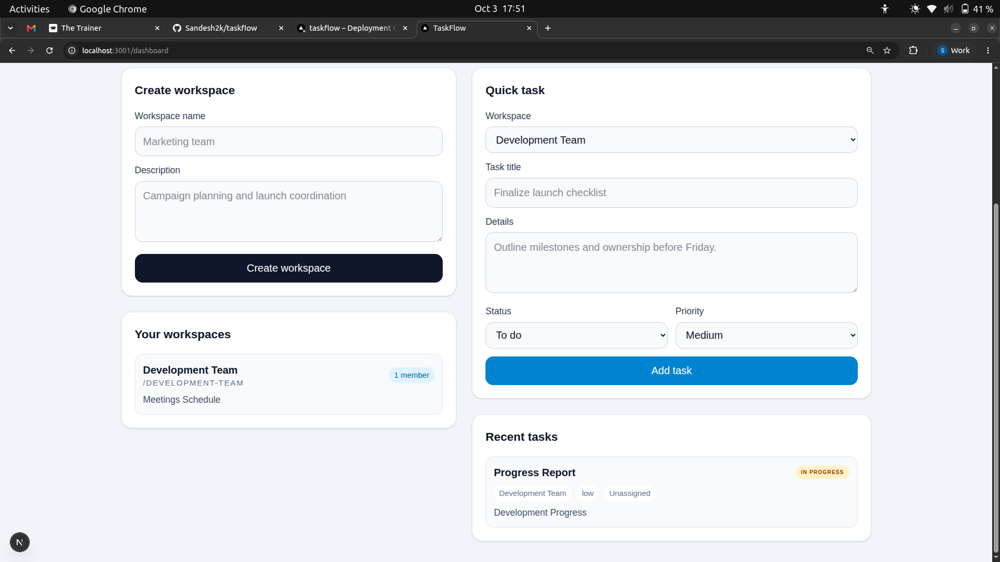
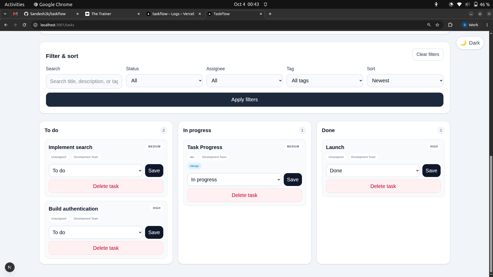
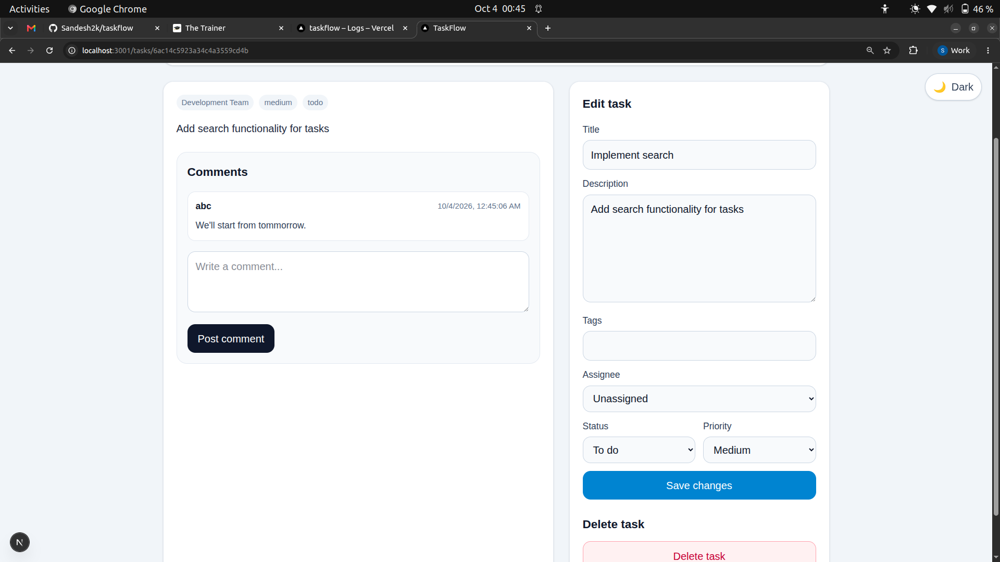

# TaskFlow

TaskFlow is a collaborative team task manager built with Next.js, MongoDB, and NextAuth. It supports workspaces, task creation, filtering, status updates, assignee assignment, comments, and dashboard analytics.

## Project description
TaskFlow helps teams organize work in a simple kanban-style board. Users can create workspaces, add tasks, move tasks between To do / In progress / Done, assign owners, add tags, and collaborate through comments. The experience is optimized for both small team planning and individual productivity.

## Stack
- Next.js 16 App Router
- React 19
- TypeScript
- Tailwind CSS
- MongoDB Atlas + Mongoose
- NextAuth credentials authentication
- Zod validation
- Node.js test runner for unit and integration checks

## Architecture summary
- Client UI renders in the browser and communicates with Next.js server routes.
- Server-side auth guards protect dashboard, task, and workspace actions.
- MongoDB stores users, workspaces, tasks, and comments.
- Aggregation queries provide task counts, due-this-week summaries, and top assignees.
- App Router caches and streaming boundaries help keep the UI responsive without overloading the database.

## Key features
- Sign up, sign in, and logout with credential auth
- Workspace creation and membership tracking
- Task board with full-text search, status filters, assignee filters, sorting, and tag filters
- Task detail page for editing, commenting, and deleting
- Dashboard analytics with counts and top assignee summaries
- Dark mode toggle for comfortable day and night usage
- Access, focus, and form semantics improvements for keyboard and screen-reader friendliness

## Stretch features added
- Dark mode toggle with persistent browser preference
- Full-text task search across task titles, descriptions, and tags via MongoDB text index

## Live URL
- Production URL: https://taskflow-puce-eta.vercel.app/

## Screenshots

- Dashboard overview

- Task board filter view

- Task detail page with comments


## Local setup
1. Install dependencies:
   ```bash
   npm install
   ```
2. Copy the environment template:
   ```bash
   cp .env.example .env.local
   ```
3. Add your local MongoDB Atlas connection string and auth secrets.
4. Start the app:
   ```bash
   npm run dev
   ```
5. Open http://localhost:3000

## Environment variables
Required values:

```bash
MONGODB_URI=mongodb+srv://<user>:<password>@<cluster>.mongodb.net/taskflow?retryWrites=true&w=majority
AUTH_SECRET=your-long-random-secret
NEXTAUTH_SECRET=your-long-random-secret
NEXTAUTH_URL=http://localhost:3000
NEXTAUTH_URL_INTERNAL=http://localhost:3000
```

   
5. Click Deploy. Once the build succeeds, update the live URL in this README and share the production link.

## Validation notes
- `npm run build` verifies the project compiles successfully in production mode.
- `npm test` executes the unit and integration checks for auth, task creation, comment behavior, and the new full-text search normalization.

## Repo structure
- `app/` — route pages and app-router screens
- `components/` — reusable UI and stats widgets
- `lib/` — auth, database, validation, and analytics helpers
- `models/` — Mongoose schemas for User, Workspace, and Task
- `docs/` — interview and architecture notes
