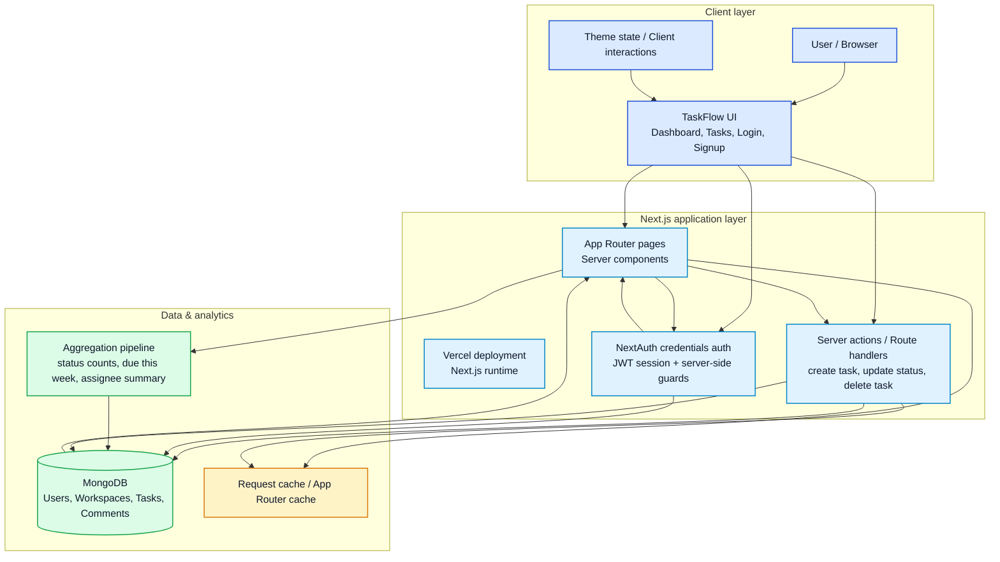

# Architecture diagram

## Notes
- The browser loads the TaskFlow UI and sends requests to the Next.js app hosted on Vercel.
- Authentication is enforced through NextAuth credentials login and server-side checks before protected pages render.
- MongoDB is the system of record for users, workspaces, tasks, comments, and filtered task metadata.
- Aggregated dashboard information such as status counts, due-date summaries, and top assignees runs through MongoDB aggregation for efficient reporting.
- Request caching and App Router caching reduce repeated work while preserving fresh task and workspace data after mutations.
