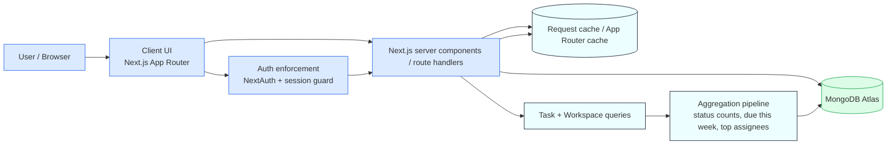

# Architecture diagram

## Notes
- The browser talks to the Next.js server for rendering and protected routes.
- Auth is enforced through server-side guards before workspace or task data is loaded.
- MongoDB remains the source of truth for users, workspaces, and tasks.
- Caching is mainly handled at the App Router and request level; expensive analytics queries are reduced with aggregation and targeted lookups.
